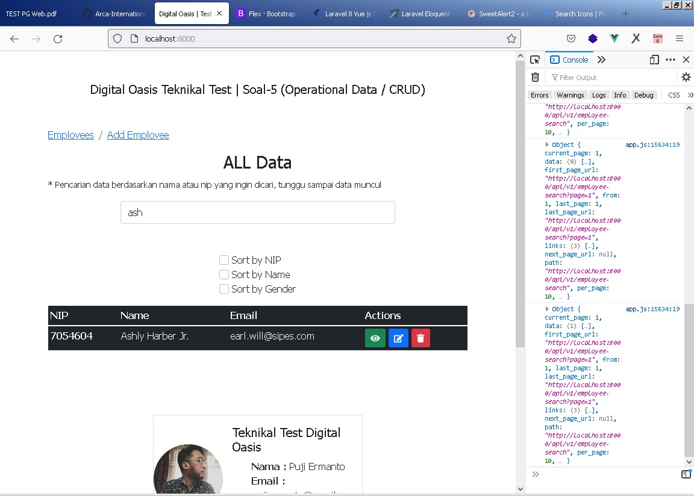
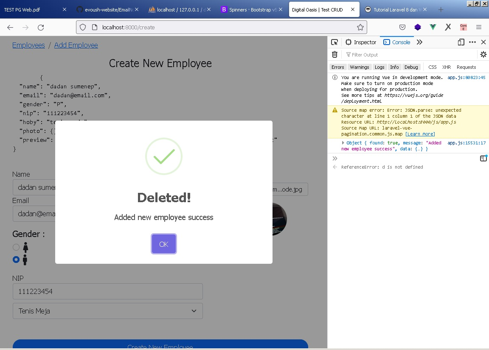

### Teknikal Test Digital Oasis

#### Preview Program Soal no.5 (CRUD)
  

  


  


  

  

  

   

  

 

   

  

 

Profile :  
> Nama : Puji Ermanto
Email : pujiermanto@gmail.com
Github  : codesyariah122
phone	: 0882 2266 8778  

##### Requirements :  
Dalam test  ini saya menggunakan Laravel(Backend) dan VueJS(Frontend) untuk databasenya saya menggunakan ```SQL(MariaDB)``` deployment di windows PC menggunakan software package ```xampp```.  
- Laravel 8 (Restfull api)
- VueJS (vue router, axios, fontawesome, bootstrap, sweetalert, momentjss, laravel-vue-pagination)  

***Catatan :***  
>Untuk  fitur update data  disini  tidak dengan  upload  photo karena manajemen waktu.  

>Tambahan field di table ```employees```  yaitu field ```storage``` dimana field ini akan jadi url  storage untuk  photo

###### Run the programm  
Untuk para penguji, dalam melakukan pengetest an  programm adalah  sebagai berikut :  
- Extract directory ```soal-1-4```  
- Jalankan programm batch ```run-program-soal-5.bat``` kemudian jalakan juga  file installasi package nya  yaitu di file ```open-installation-package.bat```  
- Setelah itu akan terbuka terminal/CMD lanjutkan dengan menjalankan beberapa command di bawah ini :   
- ```composer  install```  
- ```php artisan ui vue```  
- ```npm install```  
- ```npm run watch```

> **Note :**  
Jika terjadi error !!  

- Buka programm terminal atau (CMD/untuk pengguna windows)  
- Akses Directory/Folder ```soal-1-4/```  
- Jalankan command diatas satu persatu, berikut lengkapnya :  
**Command :**  
```
php artisan db:create
php artisan migrate
php artisan db:seed --class=EmployeeSeeder
php artisan storage:link
php artisan serve
composer  install 
php artisan ui vue 
npm install
npm run watch
```  
