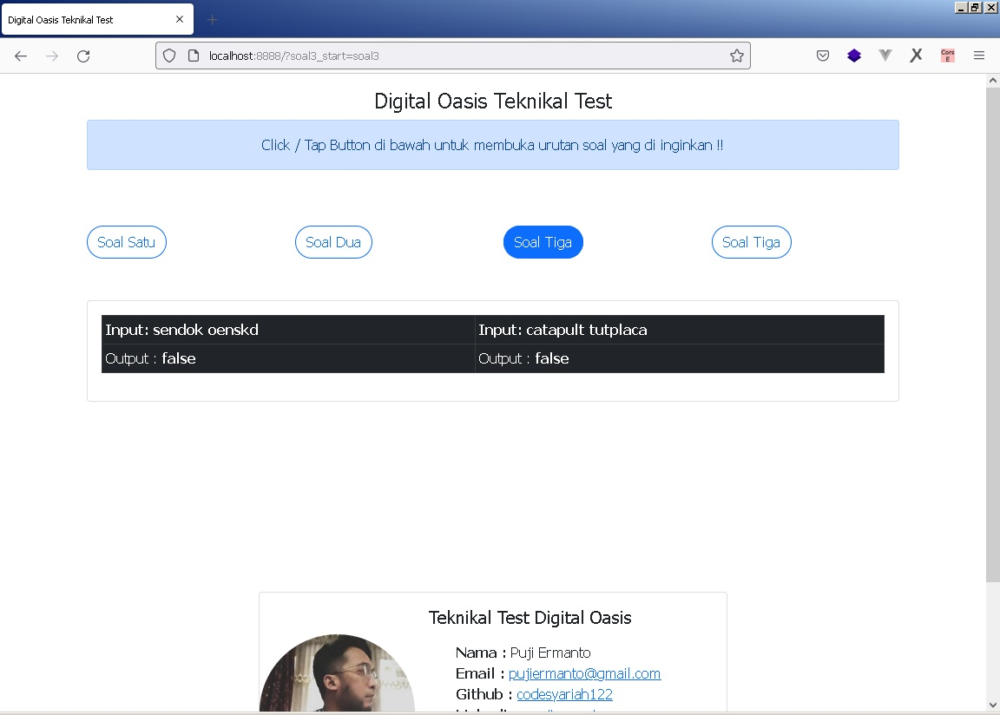
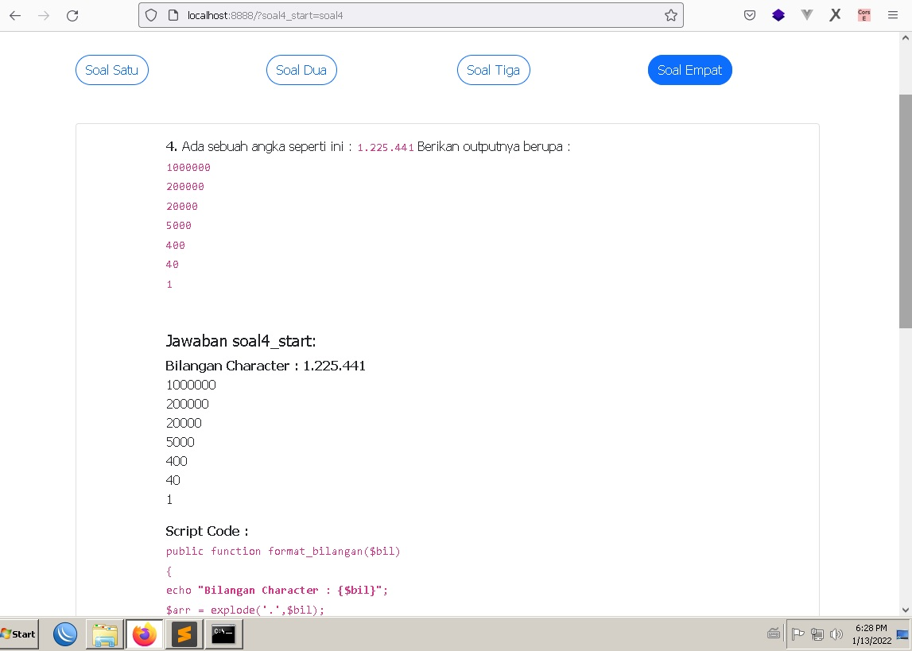

### Teknikal Test Digital Oasis

#### Preview Program  
  

  


  





Profile :  
> Nama : Puji Ermanto
Email : pujiermanto@gmail.com
Github  : codesyariah122
phone	: 0882 2266 8778  

##### Requirements :  
Dalam test  ini saya menggunakan Native PHP Basic OOP untuk databasenya saya menggunakan ```SQL(MariaDB)``` deployment di windows PC menggunakan software package ```xampp```.  
- PHP 7.3 Version  
- MariaDB 10  


###### Run the programm  
Untuk para penguji, dalam melakukan pengetest an  programm adalah  sebagai berikut :  
- Extract directory ```soal-1-4```  
- Aktifkan Software Package Web Server (xampp, MAMP) atau lainnya.  
- Kemudian jalankan file : ```start.bat```  
> **Note :**  
Jika terjadi error !!  

- Buka programm terminal atau (CMD/untuk pengguna windows)  
- Akses Directory/Folder ```soal-1-4/```  
- Jalankan comman berikut dari terminal : ```php -S localhost:port index.php```  

> **Cara Lain :**  
Jika masih terjadi error / atau proses diatas tidak berjalan, gunakan cara berikut :  
- Copy  file ```soal-1-4.zip```  ke directory/folder aplikasi/programm software package web server atau direktori web  server di tempat anda. Pindahkan ke  direktori ```C:\xampp\htdocs``` (Pengguna Windows)  
- Lanjut Akses di  ```Web Browser``` anda di url : ```localhost/direktori-project``` atau ```localhost:port```